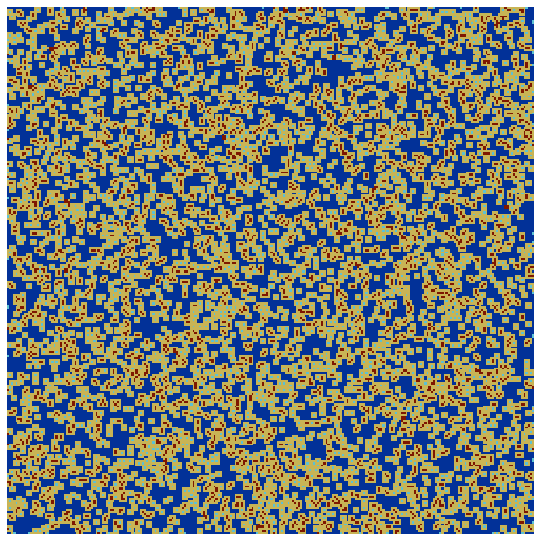

# Prison cells

**Cellular Automata (CAs)** represent a powerful and versatile platform for simulating complex systems. Here we focus on an abstraction of a social system in which pairs of neighbouring agents interact according to a famous example of game theoretical dynamic: the so-called **"Prisoner's Dilemma"**.

There are two possible strategies, **cooperation (C)** and **defection (D)**, and **no memory**. The players change their strategy each turn to emulate the neighbour(s) achieving the **greatest profit** in the previous iteration; the full payoff is the sum of the rewards of each one-to-one game.

For simplicity, the choice of values is the following 

$$
S = P = 0 \quad R = 1 \quad T = b
$$

so there is **just one parameter**. This does not prevent the model from exhibiting the full **complex dynamics**, with chaotic behaviour and **fractal** patterns.

  <i>Output example (250x250)</i>

